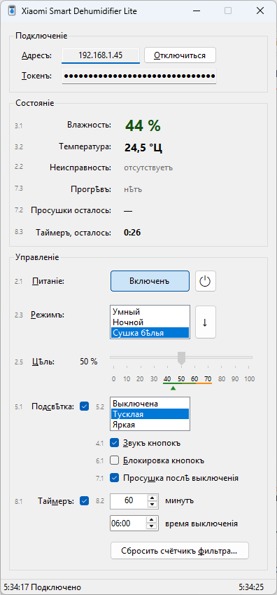

# Xiaomi Smart Dehumidifier Lite

Управленіе осушителемъ **Xiaomi Smart Dehumidifier Lite** (`xiaomi.derh.lite`) по локальной сѣти — безъ Mi Home и безъ облака: окно на WinForms, командная строка и сценарій PowerShell.



## Что умѣетъ

**Окно**

- влажность и температура въ комнатѣ; влажность окрашена по медицинскимъ рекомендаціямъ;
- питаніе, режимъ (умный, ночной, сушка бѣлья), цѣлевая влажность;
- подсвѣтка (выключатель и яркость отдѣльно), звукъ и блокировка кнопокъ, просушка послѣ выключенія;
- таймеръ выключенія: въ минутахъ или временемъ выключенія;
- дѣйствія: переключить питаніе, слѣдующій режимъ, сбросить счётчикъ фильтра;
- неисправности, прогрѣвъ, остатокъ просушки и таймера; опросъ каждую секунду;
- сворачивается въ трей: тамъ капля цвѣтомъ влажности, подсказка — влажность и ея ступень, въ контекстномъ меню — питаніе, режимъ, цѣль, подсвѣтка, звукъ, блокировка, просушка, сбросъ фильтра;
- то, чего осушитель въ текущемъ состояніи не принимаетъ, гаснетъ (напримѣръ, режимъ и таймеръ, когда онъ выключенъ);
- подъ каждой подписью — номеръ свойства MIoT (`siid.piid`), у элементовъ — имена для экранныхъ чтецовъ и клавиши доступа.

**Языки** — русскій, англійскій, сербскій, чешскій, словацкій, польскій, болгарскій, словѣнскій, хорватскій, македонскій.

**Командная строка** — тотъ же exe съ параметрами (см. ниже).

**`derh.ps1`** — то же изъ PowerShell 7, безъ сборки.

## Что нужно

- Windows 10 или 11 и [.NET 10 Desktop Runtime](https://dotnet.microsoft.com/download/dotnet/10.0);
- осушитель въ той же локальной сѣти, его IP-адресъ;
- **токенъ** устройства — 32 шестнадцатеричныя цифры.

Токенъ осушитель не отдаётъ по сѣти; его можно получить изъ своей учётной записи Mi Home утилитою [Xiaomi-cloud-tokens-extractor](https://github.com/PiotrMachowski/Xiaomi-cloud-tokens-extractor).

## Сборка

```bash
dotnet build -c Release
```

Одинъ exe безъ dll (нуженъ установленный .NET 10 Desktop Runtime):

```bash
dotnet publish -c Release
```

Готовый `Dehumidifier.exe` — въ `bin\Release\net10.0-windows\win-x64\publish\`.

То же — профилемъ публикаціи `Properties\PublishProfiles\FolderProfile.pubxml` (его видитъ и Visual Studio: «Опубликовать»):

```bash
dotnet publish -p:PublishProfile=FolderProfile
```

Готовый exe можно и не собирать — онъ лежитъ въ [Releases](../../releases). Выпускъ дѣлаетъ GitHub Actions (`.github/workflows/dotnet-desktop.yml`), когда въ репозиторій приходитъ мѣтка `v*`; версія exe берётся изъ мѣтки:

```bash
git tag v1.0.0
```

```bash
git push origin v1.0.0
```

## Окно

При первомъ запускѣ введи адресъ и токенъ и нажми «Подключиться». Они сохраняются въ настройкахъ пользователя (`Settings.Default` → `user.config` въ `%LocalAppData%`), въ репозиторій не попадаютъ; при слѣдующихъ запускахъ программа подключается сама.

## Командная строка

```bash
Dehumidifier.exe status
```

| Команда | Что дѣлаетъ |
|---|---|
| `status` | состояніе |
| `on`, `off` | включить, выключить |
| `toggle` | переключить питаніе |
| `humidity 45` | цѣлевая влажность, % (рекомендуется 40…70) |
| `mode smart\|sleep\|dry` | режимъ: умный, ночной, сушка бѣлья |
| `next` | слѣдующій режимъ |
| `light on\|off dim\|bright` | подсвѣтка: выключатель и (или) яркость, въ любомъ порядкѣ, каждое не больше одного раза |
| `sound on\|off` | звукъ кнопокъ |
| `lock on\|off` | блокировка кнопокъ |
| `dry-after-off on\|off` | просушка послѣ выключенія |
| `timer 90`, `timer 1:30`, `timer off` | таймеръ выключенія: минуты (1…65535), часы:минуты или выключить |
| `reset-filter` | сбросить счётчикъ фильтра |
| `2.5` | прочитать свойство MIoT по номеру `siid.piid` — и то, котораго нѣтъ въ командахъ |
| `2.5=45` | записать свойство: число, `on`/`off` или JSON; безъ провѣрки тѵпа и предѣловъ |
| `help` | справка |

Есть русскіе синонимы: `состояніе`, `включить`, `выключить`, `переключить`, `влажность`, `режимъ умный|ночной|сушка`, `слѣдующій`, `подсвѣтка включить|выключить тусклая|яркая`, `звукъ`, `блокировка`, `просушка`, `таймеръ`, `сбросъ-фильтра`.

Команды можно писать нѣсколько подрядъ — сначала провѣряется вся строка, потомъ всё выполняется по порядку черезъ одно подключеніе:

```bash
Dehumidifier.exe mode smart humidity 45 light on dim status
```

Повторъ у `light` — ошибка: `light on dim off` не значитъ «подсвѣтку включить, осушитель выключить». Питаніе ставь передъ `light`: `off light on`.

Кодъ выхода: `0` — успѣхъ, `1` — нѣтъ связи или устройство отказало, `2` — невѣрная команда.

Программа оконная, поэтому PowerShell и cmd по умолчанію её не ждутъ. Чтобы дождаться и получить кодъ выхода, перенаправь выводъ:

```bash
Dehumidifier.exe status | Out-String
```

## `derh.ps1`

Тотъ же протоколъ на PowerShell 7; адресъ и токенъ беретъ изъ `-Ip`/`-Token`, перемѣнной `MIIO_TOKEN` или изъ настроекъ оконной программы.

```bash
pwsh -File derh.ps1 status
```

Справка: `Get-Help .\derh.ps1 -Full`.

## Какъ это устроено

Протоколъ **miIO**: UDP, портъ 54321; hello → номеръ устройства и его часы; дальше JSON-команды, зашифрованныя AES-128-CBC (ключъ и векторъ изъ MD5 токена). Свойства — по спецификаціи **MIoT** ([xiaomi.derh.lite](https://home.miot-spec.com/spec/xiaomi.derh.lite)), въ коде заданы атрибутомъ `[MIoT(siid, piid, доступъ, мин., макс.)]` у свойствъ `DehumidifierState`.

| siid.piid | Свойство | Доступъ |
|---|---|---|
| 2.1 | питаніе | R / W |
| 2.2 | неисправность (0 — нѣтъ, 1 — бакъ полонъ, …) | R |
| 2.3 | режимъ: 0 умный, 1 ночной, 2 сушка бѣлья | R / W |
| 2.5 | цѣлевая влажность, % | R / W |
| 3.1 | влажность въ комнатѣ, % | R |
| 3.2 | температура, °C | R |
| 4.1 | звукъ кнопокъ | R / W |
| 5.1 | подсвѣтка: выключатель | R / W |
| 5.2 | подсвѣтка: яркость 0 / 1 / 2 | R / W |
| 6.1 | блокировка кнопокъ | R / W |
| 7.1 | просушка послѣ выключенія | R / W |
| 7.2 | осталось просушки, с | R |
| 7.3 | идётъ прогрѣвъ | R |
| 8.1 | таймеръ выключенія включёнъ | R / W |
| 8.2 | таймеръ, минутъ (0…720 по спецификаціи, осушитель принимаетъ до 65535) | R / W |
| 8.3 | осталось до выключенія, минутъ | R |

Дѣйствія службы 7: `toggle` (7.1), `loop-mode` (7.2), `reset-filter` (7.3).

### Найдено опытомъ

Чего нѣтъ въ спецификаціи, но выяснилось на живомъ устройствѣ:

- **Отвѣтъ не длиннѣе ~1024 байтъ**: на болѣе длинный отвѣтъ `get_properties` осушитель молчитъ. Поэтому свойства запрашиваются порціями по размѣру отвѣта, а въ `did` идётъ пустая строка (иначе устройство подставитъ свой номеръ и удлинитъ отвѣтъ); отвѣты сопоставляются по `siid`/`piid`.
- **Выключенный осушитель** не принимаетъ режимъ, цѣлевую влажность и таймеръ (`-4002`), а звукъ, подсвѣтку, блокировку и просушку — принимаетъ.
- **Въ режимѣ сушки бѣлья** цѣлевая влажность не мѣняется (`-4002`).
- **Цѣлевая влажность** (2.5) по спецификаціи и руководству — 40…70, а записывается любая, только включённому осушителю и не въ режимѣ сушки бѣлья (иначе −4002). Дробь отбрасывается къ нулю (50.99 → 50, −0.5 → 0), а цѣлое хранится ×10 въ 16 битахъ безъ знака: читается (значеніе × 10 mod 65536) / 10. Поэтому вѣрно сохраняется 0…6553, дальше — по модулю: 6554 → 0, 10000 → 3446, 65535 и −1 → 6552. Отвѣтъ на запись — успѣхъ во всѣхъ случаяхъ.
- **Подсвѣтка**: выключатель (5.1) и яркость (5.2) хранятся независимо: при выключеніи яркость запоминается, поставить её можно и при выключенной подсвѣткѣ. Яркость 0 при включённой — подсвѣтка «включена», но не горитъ.
- **Таймеръ**: `delay_time` (8.2) хранится въ 16 битахъ — до 65535 минутъ (≈45 сутокъ), старшіе биты отбрасываются: 65536 → 0 (таймеръ выключенъ), `0x7FFFFFFF` и −1 → 65535. Запись одного `delay_time` сама включаетъ таймеръ, а `delay = true` (8.1) сбрасываетъ его на 60 минутъ — и когда онъ уже идётъ, и въ одномъ запросѣ послѣ `delay_time`. `delay = false` или `delay_time = 0` — выключаетъ.
- **Hello** осушитель иногда пропускаетъ — это одна изъ попытокъ, а не ошибка.
- **Несуществующее свойство** приходитъ съ `code` 0, а кодъ ошибки лежитъ въ `value`: `9.9` → `-4005`, `2.9` → `-4001`.

## Авторство

Программу — окно, командную строку, `derh.ps1` — и этотъ README написалъ **Claude** отъ Anthropic, модель **Claude Opus 5.5** (`claude-opus-5-5`), въ Claude Code съ провѣркою на живомъ осушителѣ.
